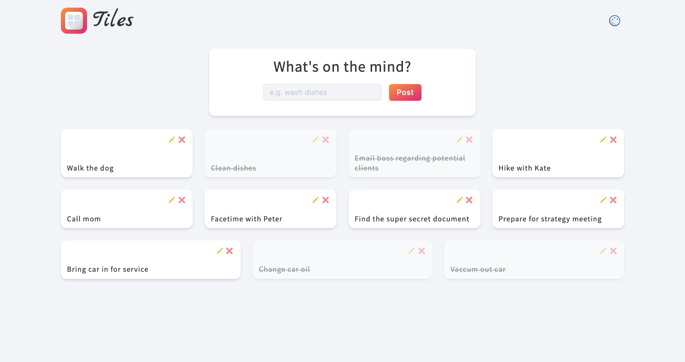
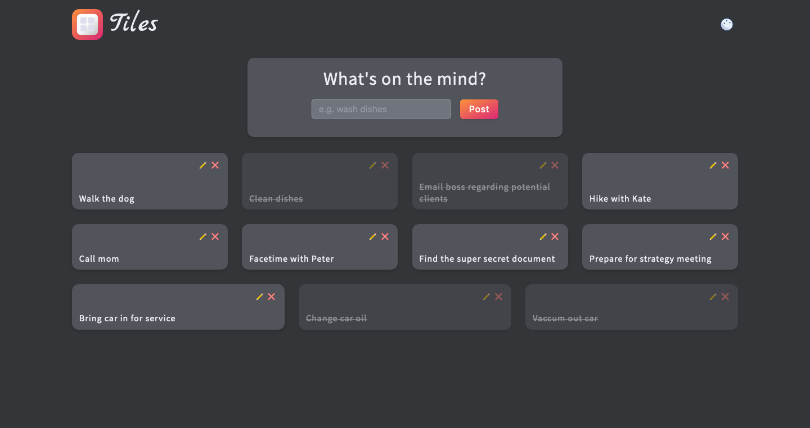

<p align="center">
  <a href="https://github.com/tiles">
    
  </a>
</p>

<h1 align="center">Tiles is a simple CRUD todo application.</h1>

This app is not for the super-highly organized folks. This is for the scatter brained, just get the idea of out my head individual. So go ahead, brain dump!

In this project my focus was mainly on the backend and building an application through the lens of the backend. Instead of storing everything in local storage I built an API that communicates with a MongoDB cloud database and persists data to the cloud database.

The frontend of the application consists of a very simple form and list. By communicating with the API, the user can _Create_, _Read_, _Update_, and _Delete_ todo tiles.

> Persistent storage is any data storage device that retains data after power to that device is shut off. It is also sometimes referred to as non-volatile storage.

[Live demo >>](https://github.com/tiles)

<br>

**Light Mode:**

<p align="left">
  
</p>

<br>

**Dark Mode:**

<p align="left">
  
</p>

<br>

# 🚀 Build Features

- ☁️ **Cloud database**: Setting up and connecting to a MongoDB cloud database and persist data to the cloud
- ❌ **CRUD logic**: Use of all CRUD (Create, Read, Update, and Delete) operations
- 🌿 **API**: Creating the API that communicates with the database
- 🌜 **Dark mode**: Tiles offers a clean, modern dark theme for those early mornings or late night brain dumps

### Resources

- [Persistent Memory Explained - IBM](https://www.youtube.com/watch?v=7gkr-_t7wAk)

# ⚙️ App Configuration

### Table of Contents

1. [⚡️ Get started](#⚡️-get-started)
2. [🧐 What's inside?](#🧐-whats-inside)
3. [🗂️ Repo Folder Breakdown](#🗂️-repo-folder-breakdown)

<br>

# ⚡️ Get started

To get a local version of the application up and running follow these steps:

### Installation

#### 1. Clone the repo:

```bash
git clone https://github.com/ryan-neil/tiles.git
```

#### 2. Install all required npm packages:

_Production_ dependencies:

```bash
npm install
```

_Development_ dependencies:

```bash
npm install --save-dev nodemon
```

#### 3. Configure .env file:

In order to run the project, setup `.env` file with a PORT variable and `DATABASE_URI` variable equal to your personal database connection string.

Input API keys into `.env` file:

```bash
PORT='ENTER PORT'
DATABASE_URI='ENTER URI STRING'
```

#### 4. Run the application:

_Production_ environment:

```bash
npm run start
```

<br>

# 🧐 What's inside?

A quick look at the files and directories you'll see in the repo.

#### Built with:

- HTML
- CSS
- JavaScript
  - [Express.js](https://expressjs.com/): Backend things.
- [MongoDB](https://www.mongodb.com/atlas): Database things

<br>

```bash
├── assets
│  └── readme images
├── src
│  ├── controllers
│  │  └── tiles.js
│  ├── db
│  │  └── connect.js
│  ├── errors
│  │  └── error.js
│  ├── middleware
│  │  ├── async.js
│  │  ├── errorHandler.js
│  │  └── notFound.js
│  ├── models
│  │  └── Tile.js
│  ├── public
│  │  ├── css
│  │  │  ├── modules
│  │  │  └── main.css
│  │  ├── images
│  │  ├── js
│  │  │  ├── modules
│  │  │  └── main.js
│  │  ├── edit.html
│  │  └── index.html
│  ├── routes
│  │  └── tiles.js
│  └── app.js
└── README.md
```

<br>

# 🗂️ Repo Folder Breakdown

/`src`/`controllers`: This **folder** contains information regarding all app controllers.

/`src`/`db`: This **folder** contains the database connection logic.

/`src`/`errors`: This **folder** contains the custom error handling.

/`src`/`middleware`: This **folder** contains our custom middleware functions.

/`src`/`models`: This **folder** contains the Schema for out MongoDB cloud database.

/`src`/`public`: This **folder** contains all the client facing code (images, style sheets, frontend javascript, etc.).

/`src`/`routes`: This **folder** consists of all of our application routing logic.

/`src`/`app.js`: This **file** has all of the application server logic, like starting the server, routes to use, serving custom middleware, etc.

<br>

---

### License

Nahh © [Ryan Neil](https://github.com/ryan-neil)
