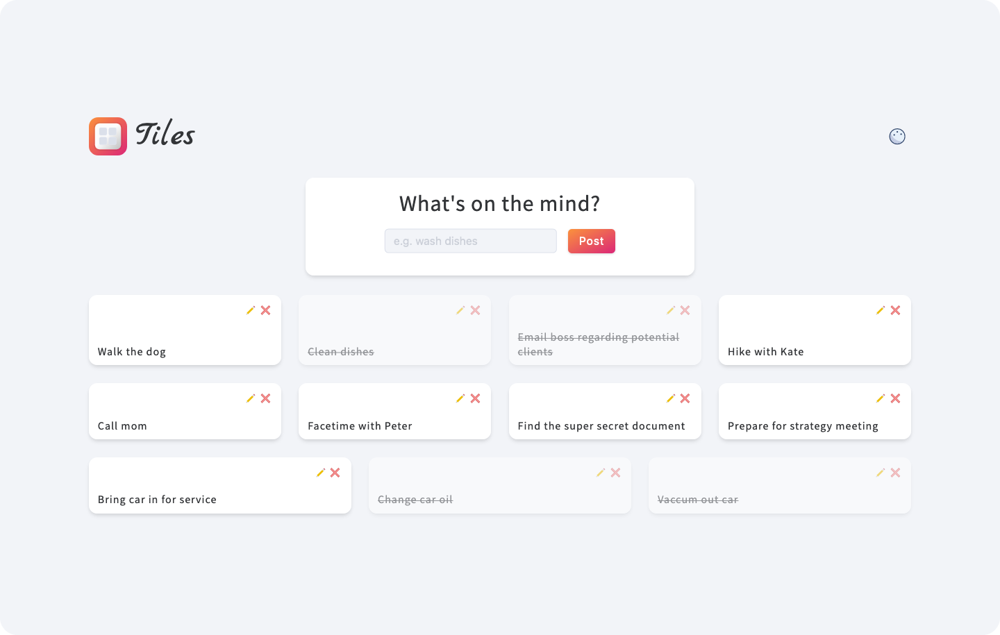
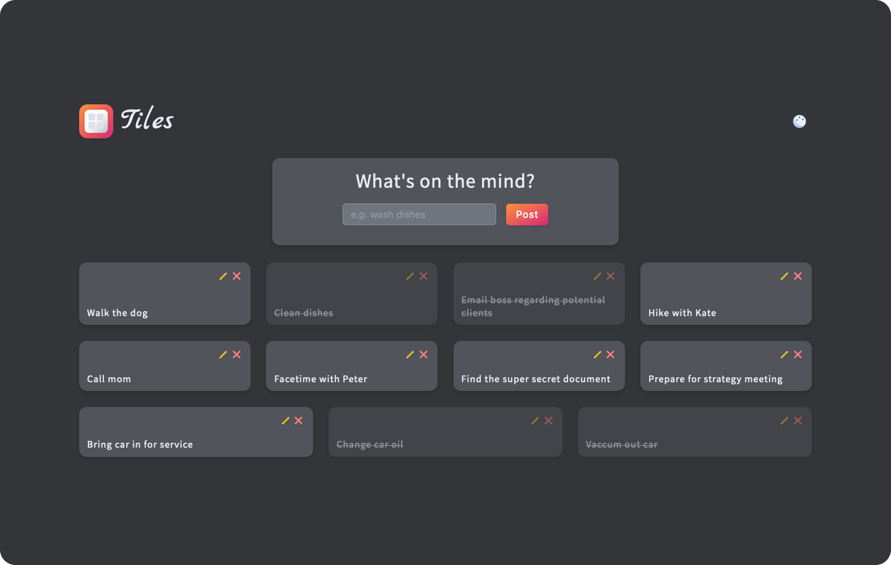

  

<h1 align="center">Tiles is a simple CRUD todo application.</h1>

This app is not for the super-highly organized folks. This is for the scatter brained, just get the idea of out my head individual. So go ahead, brain dump!

The frontend of the application consists of a very simple form and list. By communicating with the API, the user can _Create_, _Read_, _Update_, and _Delete_ todo tiles.

In this project my focus was mainly on the backend and building an application through the lens of the backend. Instead of storing everything in local storage Tiles has a built-in API that communicates with a MongoDB cloud database and persists data to the cloud.

The app is being deployed on Netlify and utilizes _serverless functions_ to build out the "serverless" backend.

[Live demo >>](https://tiles-todo.netlify.app/)

 

**Light Mode:**

  

 

**Dark Mode:**

  

 

# 🚀 Build Features

- ☁️ **Cloud database**: Setting up and connecting to a MongoDB cloud database and persist data to the cloud
- ❌ **CRUD logic**: Use of all CRUD (Create, Read, Update, and Delete) operations
- 🌿 **API**: Creating the API that communicates with the database
- 👾 **Continuous deployment**: Deploying on Netlify for streamlined development
- 🌜 **Dark mode**: Tiles offers a clean, modern dark theme for those early mornings or late night brain dumps

### Technologies:

- HTML
- CSS
- Vanilla JavaScript
  - [Express.js](https://expressjs.com/): Backend things.
  - [Netlify Serverless Functions](https://www.netlify.com/products/functions/): For serverless backend
- [MongoDB](https://www.mongodb.com/atlas): Database things

### License

Nahh © [Ryan Neil](https://github.com/ryan-neil)
